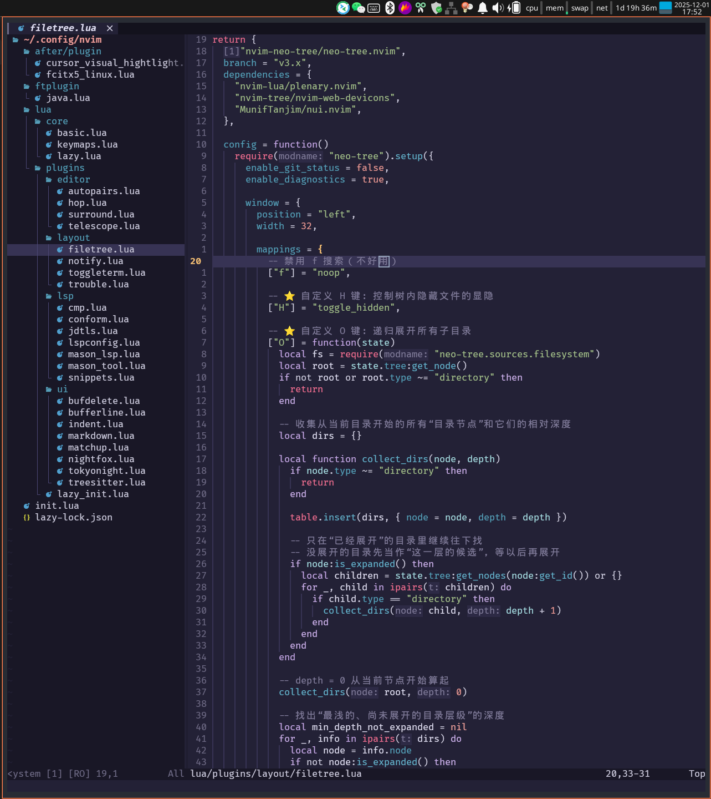
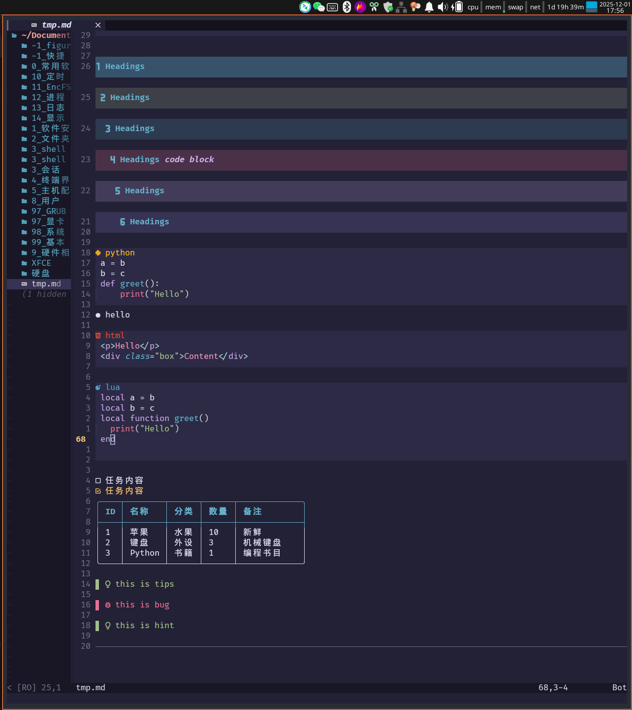

这是我的 Linux 终端开发环境配置（使用 wezterm 作为虚拟终端），包括：
- Neovim 配置
- kitty/wezterm 配置
- tmux 配置
- bash 环境

首次运行，请使用 `Lazy` 包管理器下载包，并使用 `Mason` 下载 LSP
```bash
Lazy sync
Mason
```

## Neovim 终端效果

配置中集成了多种语言服务器（LSP），包括 Java、Lua、Python、Vue、HTML、CSS、TS、Markdown，提供完整的语法高亮、代码补全、诊断修复等功能。可以取代 VSCODE 和 IDEA 80% 的功能，足以应对日常开发。Neovim 具备出色的跨平台能力，一套配置即可在 Linux、macOS、Windows 上顺畅使用。同时，Vim 的键盘操作哲学让编码更加轻盈高效，让开发过程更优雅

##### 缩进效果
前端与 Lua 脚本默认缩进使用两个空格；Java 默认缩进使用四个空格

### Lua 脚本效果展示


### Java 开发效果展示

支持 Spring 单体项目、微服务项目开发(建议结合 tmux)


### Markdown 效果展示
本配置 Markdown 暂时不支持图片预览


---

## 使用快捷键

`<leader> `设置为了空格

#### window（窗口）快捷键
Ctrl + w + h/l/j/k：切换显示窗口
`:q`：退出窗口
`:qa!`：退出全部窗口
#### buffer 快捷键
`<leader>` + bh/bl：移动当前窗口显示的 buffer
`<leader>` + bd：删除当前窗口中的 buffer
`:w`：保存 buffer 内容到硬盘
#### filetree 的快捷键
`<leader>` + e：打开/关闭树
H：控制隐藏文件显隐
O：(递归)打开子文件夹
#### LSP
`<leader> `+ xx：打开诊断栏
`<leader>` + f：自动格式化
#### 内部终端
`:toggle`：打开终端
gcc：代码注释
#### Lazy 包管理器
`:Lazy`：打开包管理器
`:Lazy sync`：打开包管理器的同时更新包
#### mason
`:mason`：打开 mason

#### 内容操作
`<leader> `+ hw（或 `:HopWord`）：全文快速跳转
`ys` + iw/2w/iwt：添加括号/引号/html tag
`ds`：删除外面包裹内容
`cs`：修改外面包裹内容
S +包裹符号：在 Visual mode 选中后进行添加包裹
S +4：在 Visual mode 选中后生成 `**内容**`（markdown 专用）

`"+y`：复制到系统剪贴板
`"+p`：从系统剪贴板板粘贴进来

`<leader>`+ f：自动格式化

`<leader>`+ rn：重命名（refactor）
`<leader>`+ gd：跳转到定义
`<leader>`+ K：悬停查看信息
##### jdtls 专属操作（Java 开发相关）
`<leader>`+ ca：诊断修复（Code Action）
`<leader>`+ oi：重排 import、删除未使用的 import、去重、排序
`<leader>`+ em：提取方法（进入 Visual mode）
`<leader>`+ ec：提取常量
`<leader>`+ ev：提取变量

#### telescope
`<leader>`+ ff：搜索文件
`<leader>`+ fg：全局搜索字符串
`<leader>`+ fb：查找打开的 Buffer
`<leader>`+ fh：搜命令
`<leader>`+ fo：搜快捷键

`<leader>`+ gc：查看 git 提交记录（git commits）
`<leader>`+ gC：查看当前文件的 git 提交记录
`<leader>`+ gb：查看 git 分支结构（git branch）
`<leader>`+ gs：查看前工作区与暂存区的状态——哪些文件变更（git status）
`<leader>`+ gS：查看 stash 内容（git stash list）
